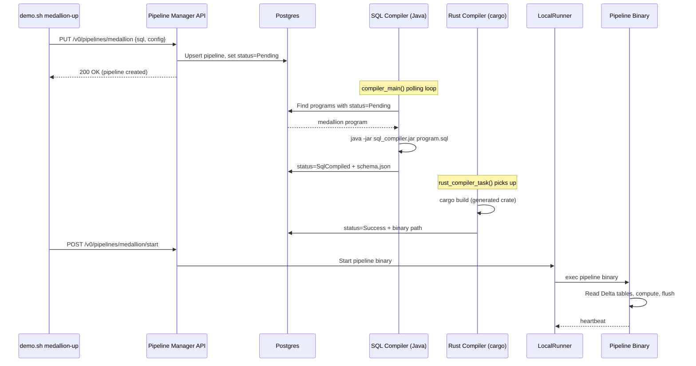

# Feldera Demo Deep-Dive: End-to-End Walkthrough

> **Audience**: You have run `demo.sh up` and `demo.sh medallion-up` and watched
> tables materialize in DuckDB. This document traces every step — from the first
> byte of the pipeline-manager binary to the last Delta Lake flush — so you
> understand *what happened under the hood*.
>
> **Scope**: Sections 1–2 of the full deep-dive series.

---

## Table of Contents

1. [Pipeline Manager: From Binary Start to API Ready](#1-pipeline-manager-from-binary-start-to-api-ready)
   - [1.1 What `demo.sh up` Does](#11-what-demosh-up-does)
   - [1.2 Container Topology](#12-container-topology)
   - [1.3 The Entrypoint Binary](#13-the-entrypoint-binary)
   - [1.4 The API Server](#14-the-api-server)
   - [1.5 Healthcheck: When Is It "Ready"?](#15-healthcheck-when-is-it-ready)
2. [SQL Submission to Running Pipeline](#2-sql-submission-to-running-pipeline)
   - [2.1 SQL + Rust Compilation](#21-sql--rust-compilation)
   - [2.2 What the Compiled Rust Code Does](#22-what-the-compiled-rust-code-does)
   - [2.3 Transactions & Commit Boundaries](#23-transactions--commit-boundaries)
   - [2.4 Delta Lake Incremental Pull](#24-delta-lake-incremental-pull)
   - [2.5 When Does a Commit Start and End?](#25-when-does-a-commit-start-and-end)
   - [2.6 State Storage for Aggregations](#26-state-storage-for-aggregations)
   - [2.7 Incremental Aggregation & Flushing](#27-incremental-aggregation--flushing)

---

## 1. Pipeline Manager: From Binary Start to API Ready

### 1.1 What `demo.sh up` Does

When you run:

```bash
./demo.sh up
```

the script resolves to a single Docker Compose invocation:

```bash
docker compose up -d --force-recreate --remove-orphans --wait
```

The `--wait` flag blocks until every service passes its healthcheck. That is the
moment you see the ✅ prompt and the API is accepting requests.

### 1.2 Container Topology

The compose file lives at `.research/demo/docker-compose.yml`. It declares three
services:

```
┌─────────────────────────────────────────────────────────┐
│                    Docker Compose                        │
│                                                          │
│  ┌──────────────────┐                                    │
│  │ init-delta-perms  │  (init container)                 │
│  │  chown 1000:1000  │──► /var/feldera/delta             │
│  └──────────────────┘                                    │
│                                                          │
│  ┌──────────────────────────────────────────────┐        │
│  │          pipeline-manager                     │        │
│  │                                               │        │
│  │   port 8080 (container) ──► 18080 (host)      │        │
│  │                                               │        │
│  │   healthcheck:                                │        │
│  │     curl --fail --silent --request GET \       │        │
│  │       --url http://localhost:8080/healthz      │        │
│  │     interval: 10s                             │        │
│  │     retries:  30                              │        │
│  │     start_period: 30s                         │        │
│  └──────────────────────────────────────────────┘        │
│                                                          │
│  ┌──────────────────┐                                    │
│  │   duckdb-sidecar  │  reads Delta Lake output          │
│  └──────────────────┘                                    │
└─────────────────────────────────────────────────────────┘
```

**`init-delta-perms`** is an init container that runs before the manager starts.
Its sole job is to `chown` the Delta output directory to UID/GID `1000:1000` so
the pipeline-manager process (running as user 1000) can write Delta Lake files.

**`duckdb-sidecar`** provides a DuckDB instance that reads the Delta output
tables — this is how you query pipeline results interactively.

### 1.3 The Entrypoint Binary

> **Source**: `crates/pipeline-manager/src/bin/pipeline-manager.rs` (lines 24–156)

The `main()` function is deceptively short — it boots the entire platform:

```
main()
  │
  ├─ 1. Install default Rustls crypto provider
  │
  ├─ 2. Raise FD limits  (soft → hard)
  │
  ├─ 3. Initialize observability / logging
  │
  ├─ 4. Build Tokio multi-thread runtime
  │
  └─ runtime.block_on(async {
       │
       ├─ 5. Connect StoragePostgres, run migrations
       │
       ├─ 6. tokio::spawn(compiler_main())
       │
       ├─ 7. tokio::spawn(runner_main::<LocalRunner>())
       │
       ├─ 8. tokio::spawn(cluster_monitor())
       │
       └─ 9. api::main::run()          ← blocks here
     })
```

**Steps 1–4** are synchronous setup that happens before any async work:

| Step | Purpose |
|------|---------|
| Rustls crypto provider | Required before any TLS connection (Postgres, HTTP clients). |
| FD limits | Pipelines open many sockets/files; the default soft limit is too low. |
| Observability | `tracing` subscriber with configurable filters (`RUST_LOG`). |
| Tokio runtime | Multi-threaded — one thread per core by default. |

**Steps 6–8** each spawn a long-lived background task:

| Task | Role |
|------|------|
| `compiler_main()` | Watches for programs in `Pending` state and drives SQL → Rust → binary compilation. |
| `runner_main::<LocalRunner>()` | Starts/stops compiled pipeline binaries on the local machine. |
| `cluster_monitor()` | Monitors pipeline health, restarts on failure, garbage-collects orphans. |

**Step 9** (`api::main::run()`) is the blocking call that keeps the process
alive. When it returns, the process exits.

#### What you see in the container logs

```
2024-XX-XX pipeline-manager | INFO  Connecting to Postgres ...
2024-XX-XX pipeline-manager | INFO  Running migrations ...
2024-XX-XX pipeline-manager | INFO  Starting compiler task
2024-XX-XX pipeline-manager | INFO  Starting runner task (LocalRunner)
2024-XX-XX pipeline-manager | INFO  Starting cluster monitor
2024-XX-XX pipeline-manager | INFO  API server listening on 0.0.0.0:8080
```

### 1.4 The API Server

> **Source**: `crates/pipeline-manager/src/api/main.rs` (lines 725–848)

The `run()` function performs three things:

1. **Bind** a `TcpListener` on `{bind_address}:{api_port}` (default `0.0.0.0:8080`).
2. **Build** a `ServerState` that holds the database pool, compiler handle,
   runner handle, and configuration.
3. **Start** an Actix `HttpServer` with two route scopes:

```
HttpServer
  │
  ├─ public_scope()     /healthz, /version, /config, ...
  │
  └─ api_scope()        /v0/pipelines/*, /v0/connectors/*, ...
```

Routes are grouped so that `public_scope()` endpoints bypass authentication
while `api_scope()` endpoints require a valid API key or session token.

### 1.5 Healthcheck: When Is It "Ready"?

> **Source**: `crates/pipeline-manager/src/api/main.rs` (lines 981–986)

```rust
#[get("/healthz")]
async fn healthz(state: WebData<ServerState>) -> impl Responder {
    state.probe.status_as_http_response()
}
```

Docker's healthcheck curls this endpoint every 10 seconds. The probe reports
"healthy" only when:

- The Postgres connection pool is live.
- Migrations have completed.
- The compiler and runner tasks are reachable.

Until all conditions are met, Docker reports the container as `starting`. After
30 retries with no success, it marks the container `unhealthy`.

```
                     ┌───────────────┐
   docker compose    │  healthcheck  │
   --wait blocks ──► │  /healthz     │──► 200 OK  ──► container: healthy
                     │  every 10s    │──► non-200  ──► container: starting
                     │  30 retries   │──► timeout  ──► container: unhealthy
                     └───────────────┘
```

---

## 2. SQL Submission to Running Pipeline

### Demo Flow

When you run:

```bash
./demo.sh medallion-up
```

the script reads `sql/medallion.sql` and PUTs it to the API:

```bash
curl -s -X PUT "http://localhost:18080/v0/pipelines/medallion" \
  -H 'Content-Type: application/json' \
  -d '{
    "name": "medallion",
    "program_code": "<contents of sql/medallion.sql>",
    "runtime_config": { "workers": 4 }
  }'
```

This single API call creates (or updates) the pipeline definition *and* triggers
compilation. What follows is a multi-stage journey from SQL text to a running
binary pushing incremental results to Delta Lake.



### 2.1 SQL + Rust Compilation

The compilation lifecycle is modeled as a state machine:

> **Source**: `crates/pipeline-manager/src/db/types/program.rs` (lines 149–170)

```
 ┌─────────┐     ┌───────────────┐     ┌─────────────┐     ┌────────────────┐     ┌─────────┐
 │ Pending  │────►│ CompilingSql   │────►│ SqlCompiled  │────►│ CompilingRust  │────►│ Success │
 └─────────┘     └───────────────┘     └─────────────┘     └────────────────┘     └─────────┘
      │                 │                                          │
      │                 ▼                                          ▼
      │          ┌─────────────┐                           ┌─────────────┐
      └─────────►│ SqlError     │                           │ RustError    │
                 └─────────────┘                           └─────────────┘
```

#### Phase 1: SQL Compilation

> **Source**: `crates/pipeline-manager/src/compiler/sql_compiler.rs`
> - `sql_compiler_task()` at line 66
> - `perform_sql_compilation()` at line 481

The SQL compiler task runs a periodic loop:

```
sql_compiler_task()               (line 66)
  loop {
    cleanup_stale_compilations()
    attempt_sql_compilation()     ──► perform_sql_compilation()
    sleep(poll_interval)
  }
```

`perform_sql_compilation()` does the heavy lifting:

1. Writes the user's SQL to `program.sql` in a temp workspace.
2. Spawns the Java process:
   ```
   java -jar sql_compiler.jar program.sql
   ```
3. Polls for the Java process to complete.
4. Reads the output:
   - `schema.json` — table/view definitions with column types.
   - `dataflow.json` — the logical plan as a graph.
   - `rust/` — the generated Rust crate source.

The Java compiler lives at:
- **Entry**: `sql-to-dbsp-compiler/SQL-compiler/src/main/java/org/dbsp/sqlCompiler/compiler/DBSPCompiler.java`
  - `compileInput()` method at line 838
- **Rust codegen**: `sql-to-dbsp-compiler/SQL-compiler/src/main/java/org/dbsp/sqlCompiler/compiler/backend/rust/ToRustVisitor.java`
  - `toRustString()` at line 144

#### What you see in the container logs (SQL phase)

```
pipeline-manager | INFO  sql_compiler: Compiling program medallion (version 1)
pipeline-manager | INFO  sql_compiler: SQL compilation succeeded for medallion
pipeline-manager | INFO  sql_compiler: Schema: 3 tables, 4 views
```

#### Phase 2: Rust Compilation

> **Source**: `crates/pipeline-manager/src/compiler/rust_compiler.rs`
> - `rust_compiler_task()` at line 74
> - `perform_rust_compilation()` at line 883

Once the SQL phase produces the generated Rust crate, the Rust compiler task
takes over:

```
rust_compiler_task()              (line 74)
  loop {
    find programs with status = SqlCompiled
    perform_rust_compilation()
    sleep(poll_interval)
  }
```

`perform_rust_compilation()`:

1. **Validates** the runtime config (worker count, storage, etc.).
2. **Prepares** a Cargo workspace with the generated crate and its dependency on
   `dbsp` and `feldera-adapters`.
3. **Calls** `cargo build --release` to produce the pipeline binary.
4. On success, sets the program status to **`Success`** and records the binary
   path.

#### What you see in the container logs (Rust phase)

```
pipeline-manager | INFO  rust_compiler: Compiling Rust for medallion
pipeline-manager | INFO  rust_compiler: cargo build --release ...
pipeline-manager | INFO  rust_compiler: Rust compilation succeeded (42s)
```

### 2.2 What the Compiled Rust Code Does

The generated crate links against the **DBSP runtime** (`crates/dbsp/`). At a
high level, the compiled binary defines:

| Concept | Rust Construct | Example |
|---------|---------------|---------|
| Input table | `InputHandle<ZSet<...>>` | `bronze_orders`, `bronze_suppliers` |
| View / transform | Operators wired into a `Circuit` | `JOIN`, `GROUP BY`, `WINDOW` nodes |
| Output view | `OutputHandle<ZSet<...>>` | Gold-layer aggregation tables |
| Sink | Delta Lake writer adapter | Writes Parquet files to `/var/feldera/delta/` |

The binary is a self-contained streaming engine. When the runner executes it, the
binary:

1. Opens input adapters (Delta Lake readers, HTTP, Kafka, etc.).
2. Constructs the DBSP circuit from the generated operator graph.
3. Enters the **step loop** — processing input batches and producing output
   deltas.
4. Flushes output to sinks (Delta Lake, HTTP, Kafka, etc.).

### 2.3 Transactions & Commit Boundaries

This is the heart of DBSP's execution model. Understanding *step* and
*transaction* is essential.

> **DBSP paper reference**: §2 *Streams and Z-sets*, §3 *Incremental
> computation*, §4 *DBSP* — the algebraic framework that makes all of this
> correct.

| Term | Definition |
|------|-----------|
| **Step** | One clock tick of the root circuit. Processes one batch of input changes and produces one batch of output changes. |
| **Transaction** | A logical batch of input changes that are committed atomically. May span multiple steps, but outputs become visible only when the transaction commits. |

> **Source**: `crates/dbsp/src/circuit/dbsp_handle.rs`
> - `DBSPHandle::step()` — advances the circuit by one tick.
> - `DBSPHandle::commit_transaction()` — finalizes the current transaction.
> - `DBSPHandle::start_commit_transaction()` — begins the commit sequence.

The controller drives the step loop:

> **Source**: `crates/adapters/src/controller.rs` (lines 2875–2951)

```
              ┌─────────────────────────────────────┐
              │         Controller Step Loop         │
              │                                     │
              │   push(data) ──► InputHandles       │
              │         │                           │
              │         ▼                           │
              │   start_commit_transaction()        │
              │         │                           │
              │         ▼                           │
              │   ┌──────────┐                      │
              │   │  step()  │◄──── loop until      │
              │   │          │      returns true     │
              │   └──────────┘                      │
              │         │                           │
              │         ▼                           │
              │   outputs ready in OutputHandles    │
              │         │                           │
              │         ▼                           │
              │   checkpoint() (optional)           │
              └─────────────────────────────────────┘
```

A step returning `true` signals that the current transaction is complete and
all output handles contain consistent results.

### 2.4 Delta Lake Incremental Pull

The medallion demo's input tables use Delta Lake as their source:

```sql
CREATE TABLE bronze_orders (...)
WITH (
    'connectors' = '[{
        "transport": {
            "name": "delta_table_input",
            "config": {
                "uri": "abfss://public@rakirahman.dfs.core.windows.net/...",
                "mode": "snapshot",
                "transaction_mode": "snapshot"
            }
        }
    }]'
);
```

Key configuration:

| Parameter | Value | Meaning |
|-----------|-------|---------|
| `mode` | `"snapshot"` | Read the full table snapshot (all versions). |
| `transaction_mode` | `"snapshot"` | Each Delta version is one atomic transaction. |
| URI scheme | `abfss://` | Azure Blob Storage (ADLS Gen2). |

> **Source**: `crates/adapters/src/integrated/delta_table/input.rs` (line 103)
> — `DeltaTableInputEndpoint` struct and implementation.

**One Delta version = one atomic transaction.** When the Delta table at the
source has versions 0, 1, 2, ..., the input adapter reads each version as a
separate transaction. The DBSP circuit processes each version's changes
incrementally — it never re-reads the entire table.

### 2.5 When Does a Commit Start and End?

Putting §2.3 and §2.4 together, here is the full lifecycle of a single
transaction in the medallion demo:

```
1. Input adapter reads Delta version N
   └─► push() row changes to InputHandles

2. Controller calls start_commit_transaction()

3. Controller enters step loop:
   ┌────────────────────────────────────────┐
   │  step() → false   (more work needed)   │
   │  step() → false                        │
   │  step() → true    (transaction done)   │◄── outputs are now consistent
   └────────────────────────────────────────┘

4. Output adapters flush to Delta Lake sinks
   └─► Parquet files written to /var/feldera/delta/

5. Optional: checkpoint() persists operator state
```

### 2.6 State Storage for Aggregations

SQL aggregations require the engine to maintain **state** across transactions.
DBSP stores this state in memory using its **Trace** data structure.

> **DBSP paper reference**: §3 *Incremental computation* — traces are the
> mechanism by which DBSP maintains enough history to compute incremental
> results.

| SQL Pattern | DBSP State | Key | Value |
|------------|-----------|-----|-------|
| `GROUP BY category, week` | Trace | `(category, week)` | Running aggregates (SUM, COUNT, etc.) |
| `OVER (PARTITION BY ... ORDER BY ...)` | Ordered Trace | Partition key | Ordered rows for window frame |

**Spine batches**: Internally, a Trace is organized as a **Spine** — a
log-structured merge tree of immutable batches. Each step appends a new batch;
background compaction merges small batches into larger ones, keeping memory
bounded and lookups fast.

```
Trace (Spine)
  │
  ├── Batch 0  (compacted: versions 0–99)
  ├── Batch 1  (compacted: versions 100–149)
  ├── Batch 2  (version 150)
  └── Batch 3  (version 151, current)
```

All state lives **in memory**. There is no disk-based state backend in the
default configuration. This means:

- ✅ Extremely fast random access and updates.
- ⚠️ Pipeline memory usage grows with the size of stateful operators.

### 2.7 Incremental Aggregation & Flushing

This is where DBSP's algebraic framework pays off. Let's trace a single INSERT
through the medallion pipeline.

#### Example: New row in `bronze_suppliers`

```
 1. Delta input adapter reads new row from bronze_suppliers
    └─► Change: Z-set delta { (supplier_row, +1) }

 2. JOIN with bronze_orders (delta-join rules):
    ├─► new_suppliers ⋈ old_orders  → output deltas
    └─► old_suppliers ⋈ new_orders  → (none this step)

 3. GROUP BY aggregation:
    ├─► Lookup affected group key in Trace
    ├─► Compute new aggregate value
    └─► Emit delta: { (old_agg, -1), (new_agg, +1) }

 4. Output buffer accumulates deltas
    └─► Flush trigger:
        ├─► Timer fires (every ~10s), OR
        └─► Transaction commits
```

> **DBSP paper reference**: §3 *Incremental computation* — the algebraic rules
> that make delta-joins and incremental aggregation correct:
>
> - **Linearity**: `Inc(f)(Δx) = f(Δx)` for linear operators.
> - **Chain rule**: `Inc(f ∘ g) = Inc(f) ∘ Inc(g)` — compose incremental
>   operators.
> - **Bilinearity of join**: `Δ(A ⋈ B) = (ΔA ⋈ B) ∪ (A ⋈ ΔB) ∪ (ΔA ⋈ ΔB)`
>   — only new combinations are computed.

The critical insight: **no operator re-scans its entire input.** Every operator
in the circuit receives *only the changes* (Z-set deltas) and produces *only the
changes* to its output. Aggregations update only the affected groups.
Full-table scans happen exactly once — when the initial snapshot is loaded.

#### Output Flushing

Output adapters (Delta Lake writers) buffer changes and flush on two triggers:

1. **Timer**: A configurable interval (default ~10 seconds) triggers a flush of
   whatever has accumulated.
2. **Commit boundary**: When `step()` returns `true` and the transaction
   commits, all pending output is flushed to ensure consistency.

Each flush writes one or more Parquet files to the Delta Lake output directory
(`/var/feldera/delta/<table_name>/`), along with a Delta transaction log entry.

---

## Quick Reference: Source Files

| Component | File | Key Lines |
|-----------|------|-----------|
| Entrypoint binary | `crates/pipeline-manager/src/bin/pipeline-manager.rs` | 24–156 |
| API server | `crates/pipeline-manager/src/api/main.rs` | 725–848, 981–986 |
| Program status enum | `crates/pipeline-manager/src/db/types/program.rs` | 149–170 |
| SQL compiler task | `crates/pipeline-manager/src/compiler/sql_compiler.rs` | 66, 481 |
| Rust compiler task | `crates/pipeline-manager/src/compiler/rust_compiler.rs` | 74, 883 |
| Java SQL compiler | `sql-to-dbsp-compiler/SQL-compiler/src/main/java/org/dbsp/sqlCompiler/compiler/DBSPCompiler.java` | 838 |
| ToRustVisitor | `sql-to-dbsp-compiler/SQL-compiler/src/main/java/org/dbsp/sqlCompiler/compiler/backend/rust/ToRustVisitor.java` | 144 |
| DBSP handle | `crates/dbsp/src/circuit/dbsp_handle.rs` | step(), commit_transaction() |
| Controller step loop | `crates/adapters/src/controller.rs` | 2875–2951 |
| Delta input endpoint | `crates/adapters/src/integrated/delta_table/input.rs` | 103 |

## Further Reading

- **DBSP paper**: *DBSP: Automatic Incremental View Maintenance* —
  [arXiv:2203.16684](https://arxiv.org/abs/2203.16684)
  - §2: Streams and Z-sets (the mathematical foundation)
  - §3: Incremental computation (how operators become incremental)
  - §4: DBSP (the complete algebraic framework)
- **Feldera documentation**: [docs.feldera.com](https://docs.feldera.com)
- **Delta Lake protocol**: [delta.io/protocol](https://github.com/delta-io/delta/blob/master/PROTOCOL.md)
